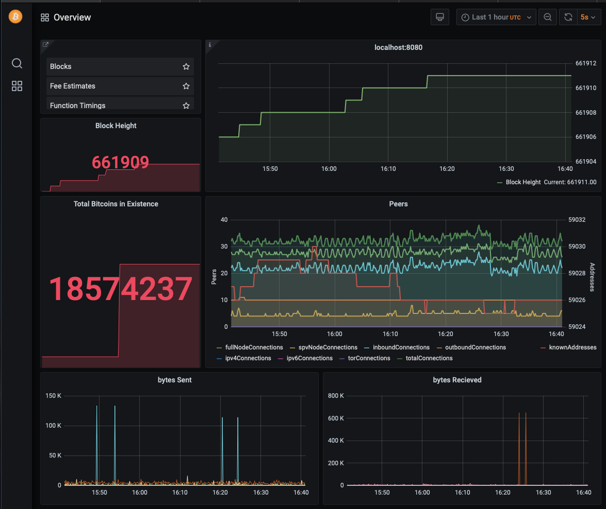

# [stats.bitcoincore.dev](https://github.com/bitcoincore-dev/stats.bitcoincore.dev)



### Install make
```
Linux:
sudo apt-get install build-essential
MacOS:
brew install make
```
### Install Docker
```
Linux:
sudo apt-get docker-ce docker-ce-cli containerd.io
MacOS:
brew install --cask docker
```

### Run:

```
git clone https://github.com/bitcoincore-dev/stats.bitcoincore.dev
cd stats.bitcoincore.dev

```
##### $ <code>make</code>

```
make slim # Run stats.bitcoincore.dev container with pre built signed binaries
make all  # Run stats.bitcoincore.dev container with compiled binaries
make init # Installs prefixed stats-<command>

```

### OpenGPG: [signature](./conf/usr/local/bin/randymcmillan.asc)

##### $ <code>stats-\<command></code> <code>commands assume image is most recent container</code>

```
stats-console              # container command line
stats-bitcoind             # start container bitcoind -daemon
stats-debug                # container debug.log output
stats-whatami              # container OS profile
```
```
stats-cli -getmininginfo   # report mining info
stats-cli -gettxoutsetinfo # report txo info
```

#### WARNING: (effects host datadir)

```
stats-prune           # default in bitcoin.conf is prune=1 - start pruning node

```

--

## Other Notes

A system metrics daemon is available [here](https://github.com/jlopp/bitcoin-utils/blob/master/systemMetricsDaemon.py)

Statoshi also supports running multiple nodes that emit metrics to a single graphite instance. 
In order to facilitate this, you can add a line to bitcoin.conf that will partition each 
metric by the name of the host: statshostname=yourNodeName--

## Docker Notes

## [stats.bitcoincore.dev](https://github.com/bitcoincore-dev/stats.bitcoincore.dev/packages/314536)

#### Full Build

This runs the statoshi configuration and [displays statsd data from the pruned node](http://stats.bitcoincore.dev).

```
docker.pkg.github.com/bitcoincore-dev/stats.bitcoincore.dev/stats.bitcoincore.dev
0.20.99             a27f8eb4ad39        4 minutes ago       2.98GB
```

Pull image from the command line:

	docker pull docker.pkg.github.com/bitcoincore-dev/stats.bitcoincore.dev/stats.bitcoincore.dev:0.20.99

Use as base image in DockerFile:

	FROM docker.pkg.github.com/bitcoincore-dev/stats.bitcoincore.dev/stats.bitcoincore.dev:0.20.99

## [Digital Ocean](https://m.do.co/c/ae5c7d05da91) Notes

NOTES

--

## Statoshi: Bitcoin Core + statistics logging

## What is Statoshi?

Statoshi's objective is to protect Bitcoin by bringing transparency to the activity 
occurring on the node network. By making this data available, Bitcoin developers can 
learn more about node performance, gain operational insight about the network, and 
the community can be informed about attacks and aberrant behavior in a timely fashion.

There is a live Grafana dashboard at [statoshi.info](http://statoshi.info)

## License

Statoshi is released under the terms of the MIT license. See [COPYING](COPYING) for more
information or see http://opensource.org/licenses/MIT.

## Development Process

Statoshi's changeset to Bitcoin Core is applied in the `master` branch and is
built and tested after each merge from upstream or from a pull request. However,
it not guaranteed to be completely stable. We do not recommend using Statoshi
as a Bitcoin wallet.

A guide for Statoshi developers is available [here](https://medium.com/@lopp/statoshi-developer-s-guide-241ac9ab9993#.s1rfi3fv6)

## Other Notes

A system metrics daemon is available [here](https://github.com/jlopp/bitcoin-utils/blob/master/systemMetricsDaemon.py)

Statoshi also supports running multiple nodes that emit metrics to a single graphite instance. 
In order to facilitate this, you can add a line to bitcoin.conf that will partition each 
metric by the name of the host: statshostname=yourNodeName